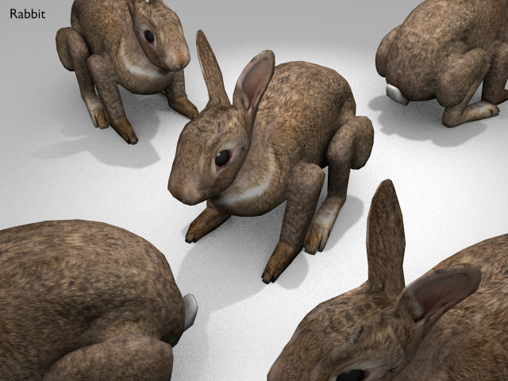
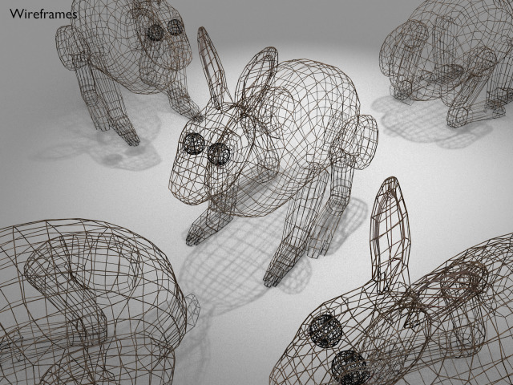

Rabbit
===





License
===

```
© 2016 Mark Raynsford <visual@io7m.com>

This work is licensed under a Creative Commons Attribution 4.0
International License.

You should have received a copy of the license along with this
work. If not, see <http://creativecommons.org/licenses/by/4.0/>.

```

Scene statistics
===

```
Mesh: rabbit_eye.L
  Polygons: 224
  Textures:

Mesh: rabbit_eye.R
  Polygons: 224
  Textures:

Mesh: rabbit_mesh
  Polygons: 3765
  Textures:
    Image: albedo 1024x1024

```

